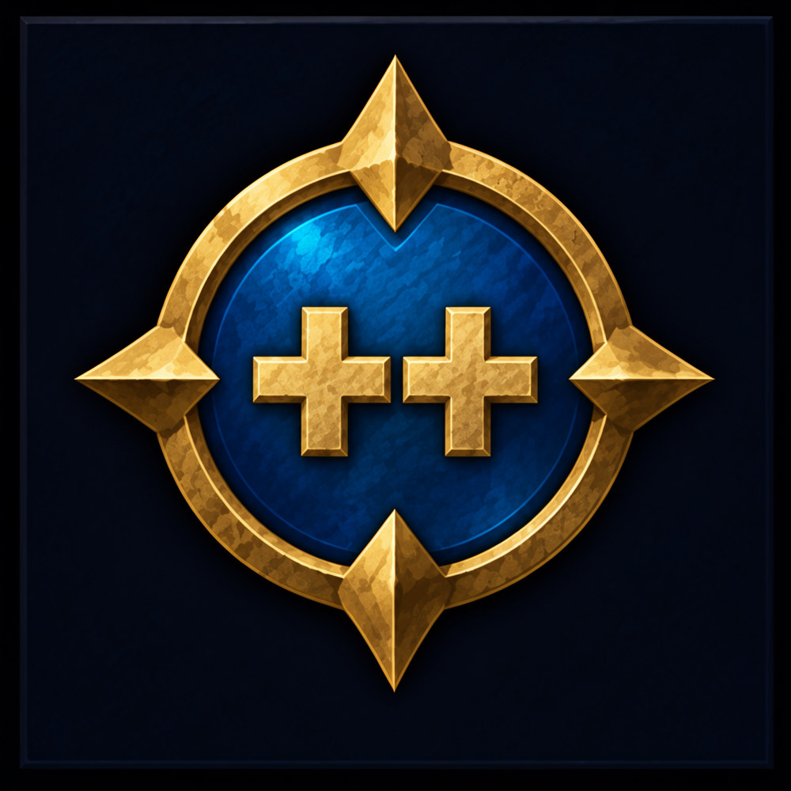

<p align="center"></p>

# Forever++

A World of Warcraft addon for **WoW: Forever** that adds to and changes the default UI in small, separate modules. It doesn't replace the UI: every change is meant to look like Blizzard shipped it, needs no setup, and can be turned off on its own.

## Modules

Everything is on by default except where noted. Each module can be turned off, and most have options.

| Module | What it does |
|---|---|
| **Automation** | |
| Auto Decline | Turns down duel requests, and optionally party invites without the invite sound, and says in chat who asked. Can let friends and guildmates through. Off by default. |
| Auto Dismount | Gets you off your mount or stands you up when a spell, flight, loot, or attack fails because you're mounted or sitting. Can also leave shapeshift forms (off by default). |
| Auto Gossip | When an NPC has only one thing to say and no quests, picks it for you, so the bank, shop, or flight map opens straight away. Hold Shift to choose yourself. |
| Auto Release | Releases your spirit when you die in a battleground, unless you can resurrect yourself or someone is resurrecting you. Off by default. |
| Auto Repair | Repairs your gear at any merchant who repairs and says in chat what it cost. Hold Shift to skip it (an option). |
| Auto Sell Junk | Sells the gray items in your bags when a merchant opens and says in chat what they sold for. Can stop at 12 items so all can be bought back. Hold Shift to skip it (an option). Off by default. |
| Auto Stow | Puts your weapons away a few seconds after combat ends. |
| Fishing Cast | Double right-click in the world with a fishing pole equipped to cast Fishing, and the click after that loots as usual. Never while in combat, and it warns you once when combat starts with the pole still equipped. Off by default. |
| Fast Loot | With auto loot on, takes everything at once instead of waiting for the loot window. |
| Gathering Tracking | Keeps Find Minerals or Find Herbs on after logging in, zoning, or dying, and can swap between the two. |
| Skip Cinematics | Skips cinematics and movies you've already seen on any character, or every one. Hold Shift to watch. Off by default. |
| **Items** | |
| Already Known | Marks recipes, mounts, pets, toys, and other items you already know or have with a green check (or tint) on their icon, on merchants, the auction house, bags, mail, and the loot window, each with its own checkbox. |
| Auction Prices | Scans the auction house when you open it and shows the lowest buyout in item tooltips, under the sell price. In the professions window, shows a recipe's total reagent cost, the crafted items' worth, and the profit under the recipe's description. |
| Best Quest Reward | Puts a gold coin on the quest reward choice that sells to a vendor for the most (price times count), in the quest window and the quest log. Ties are all marked; it never picks for you. |
| Bag Slot Counter | Shows how many bag slots are free on the backpack button, or each bag's own count on its button, with the reagent bag counted on its own. |
| Durability Bars | Shows a small bar beside each item on the character window with how worn it is. |
| Item Count | Shows how many of an item you own in its tooltip, above the prices, and how many are in your bags and your bank, with small bag and bank icons (or words). The bank is counted each time you open it. Off by default. |
| Profession Tooltips | Shows the skill a herb, ore, skinnable beast, or locked lockbox or chest needs in its tooltip, colored like trainer recipes against your skill, and the skill that gathers herb, ore, and stone items. Gathering for professions you have, or always; Lockpicking only for characters who can pick locks, or blacksmiths with their skeleton keys. |
| Sell Price | Shows the vendor price of the whole stack in item tooltips. Hold Shift for one item. |
| **Interface** | |
| Auto Screenshot | Takes a screenshot when you level up, earn an achievement, or defeat a boss, and can for good loot, reputation, PvP ranks, titles, battlegrounds, and deaths. Off by default. |
| Hide Beta Feedback | Hides the beta's "Press F6 to submit an issue" tooltip line, bug report button, and quest window feedback buttons. Off by default, and only on beta and PTR clients. |
| AddOns List | Shows the AddOns list without category headers, enabled addons first, each in name order. Options for ungrouping disabled addons and searching notes. On by default. |
| Spell Ranks | Marks the spells on your action bars that have a higher rank you already know, with a warning badge or a red tint over the button, and says the best rank in the spell's tooltip. `/fpp ranks` lists them. |
| Recipe Colors | Colors recipes in the professions window by your chance of a skill-up: orange, yellow, green, or gray, with the row's highlight to match. |
| Combat Alert | Floats a red "Entering Combat" or green "Leaving Combat" line up and away from the middle of the screen, each with its own checkbox, plus how long it stays (move and resize it in Edit Mode). Off by default. |
| Error Catcher | Catches Lua errors, blocked actions, and Lua warnings quietly instead of in Blizzard's error window and popup, and keeps them per session with how often each happened, its stack, and its locals. A window (`/fpp errors`, or the minimap button with this session's count) lists them for this session, the last one, or all, shows the one you pick, and has a Copy Bug Report button that selects a report with the addon version, client build, modules on, and the error, ready to copy. Ctrl-right-click the button to clear this session's errors (a right-click alone opens Forever++ settings). Options for the minimap button, the clear key, and a chat message for each new error (off by default). On by default. |
| Currency Bar | Shows your gold in a small tooltip-styled box, all three coins always, and optionally the currencies you tick Show on Backpack. Hovering it lists your gold and currencies with what this session gained or spent. Options for the tooltip, the session figures, and a column layout (move and resize it in Edit Mode). Off by default. |
| Character Frame Enhancements | Moves the Character window's Equipment and Pet tabs to the side with the Reputation and Skills tabs, removes the portrait and level line above the stats so they start at the top, and shows your level and name in your class color as the title. Options for each. On by default. |
| Quest Tracker | Restyles Blizzard's quest tracker rather than replacing it, so Edit Mode, its menus, and quest items work as before. Options for the font, font size, and outline, a dark box behind it that fits your quests (opacity, border, and padding), and fading it in combat. On by default. |
| Forever Quest Icons | Marks quests that are new to Forever (not in original Classic) with an infinity sign, or the Forever logo, after their name in the quest log on the world map, the objective tracker, and a quest giver's list of quests, each with its own checkbox and icon size slider. On by default. |
| Tooltips | Colors unit and item tooltips by class, reaction, or quality, colors the Horde or Alliance line red or blue, and adds player titles and who a unit is targeting. |
| **Chat** | |
| Chat Copy | Adds a button beside the chat window that opens the chat as text, already selected, so you can copy it with Ctrl+C. A slider sets how many lines. |
| Short Channel Names | Shows chat channels as [1], [G], or [1. G] instead of [1. General], as number and letter ([3. T]) by default. Off by default. |
| Chat Font | Draws the chat windows in another of the game's fonts (Friz Quadrata, Arial Narrow, Skurri, or Morpheus), keeping their size, and optionally the chat input box too. Unavailable on Korean, Chinese, and Russian clients, whose chat font needs fallbacks. |
| Persistent Chat | Keeps chat text on screen instead of fading it out after a while. |
| Chat History | Keeps each chat window's latest lines when you log out or reload and shows them again at login. A slider sets how many lines, and a checkbox the line that marks where it ends. |
| Social Button | Moves the social (Quick Join) button down beside the chat window's other buttons. |
| **Map** | |
| Points of Interest | Shows dungeons, raids, capital cities, flight masters, boats, zeppelins, and spirit healers on the world map, each with its own checkbox, icon size, and whether it also shows on continent maps. |
| Zone Info | Shows a panel in a corner of the world map (bottom left by default; in a right corner it is mirrored, icons on the right) with the zone's level range colored against yours, who holds it, its dungeons, the fishing skill it needs, and the herbs, ore, and skinning in it for the professions you have. On a continent map, it's the zone under the cursor. Herbs, ore, and skinning can each be off, shown with the profession, always, or only while you hold the detail key (Shift, Alt, or Ctrl), and so can fishing and dungeons; the panel has a size slider. |
| Unexplored Areas | Shows the parts of zone maps you haven't explored yet on the world map and zone map, tinted in a color and strength you choose, or just like explored areas. |
| Coordinates | Shows your coordinates on the left of the world map's title bar and the cursor's on the right, each with its own checkbox, plus tenths and the minimap. It turns on the game's own coordinates, so it matches Settings > Gameplay > Interface. |
| Flight Timer | Times every flight you take, remembered by the game's flight point IDs, then shows a bar counting the flight down (move and scale it in Edit Mode) and the time on the flight map's tooltip. |
| Hide Filter Reset | Hides the reset button on the world map's filter dropdown, which otherwise shows whenever a filter is off. |
| **Unit Frames** | |
| Class Colors | Shows players' health bars, and optionally names (class color or white) and target and focus name backgrounds, in their class color on the player, target, focus, party, and target-of-target frames, and hostile and neutral NPCs' health bars in red and yellow. |
| **Nameplates** | |
| NPC Nameplates | Always shows friendly NPCs' names with their title, with a name size slider and a choice of where buffs sit. The health bar appears only when they're hurt or in combat. |
| Player Nameplates | Always shows friendly players' names with their guild, with a name size slider, a choice of where buffs sit, and an icon (or light blue name) for recent allies. The health bar appears only when they're hurt or in combat. |
| Quest Nameplates | Shows a quest icon that matches the objective (kill, item, or interact) and your progress (3/8, or how many are left) beside the health bar of creatures you need for a quest. In a party it can count everyone's progress added up, or the member furthest from done. |
| **Tools** | |
| Console Variables | A page in Settings to browse and change the game's console variables (CVars). |

## Install

1. Get it from [CurseForge](https://www.curseforge.com/wow/addons/foreverplusplus), or download the zip from the latest [release](https://github.com/xIGBClutchIx/ForeverPlusPlus/releases), or for the newest build, from the latest successful [Check run](https://github.com/xIGBClutchIx/ForeverPlusPlus/actions/workflows/check.yml) on `main` (under Artifacts; needs a GitHub login).
2. Unzip it into the Forever client's AddOns folder, for example `World of Warcraft\_classic_beta_\Interface\AddOns\`, so you end up with `AddOns\ForeverPlusPlus\ForeverPlusPlus.toc`.
3. Start the game, or `/reload` if it's already running.

## Use

Open Game Menu > Options > AddOns > Forever++. It opens on a welcome page with the version, links, and commands, and two buttons: Defaults puts every module's settings back to how they start, and Clutch's Default does that and also turns on Fishing Cast, Skip Cinematics, Auto Screenshot, Currency Bar, Hide Beta Feedback, and Short Channel Names, and sets Zone Info's Dungeons and Fishing to Hold Detail Key. Modules has a checkbox for each module, grouped by category; the gear beside a module shows its options under it. Console Variables is its own page, Debug has testing options and the Self Test button, and Changelog has what changed in each release (also in [CHANGELOG.md](CHANGELOG.md)).

| Command | What it does |
|---|---|
| `/fpp` | Opens the Forever++ settings (`/forever++` works too). |
| `/fpp list` | Lists the modules and whether each is on. |
| `/fpp toggle <module> [option]` | Turns a module on or off, or with an option, flips that checkbox. |
| `/fpp options <module>` | Lists a module's options and their values. |
| `/fpp set <module> <option> [value]` | Changes an option: `on`/`off`, a choice such as `/fpp set PlayerPlates level after`, or a number such as `/fpp set PointsOfInterest dungeonSize 150`. Leave out the value to see the choices. |
| `/fpp reset` | Puts every setting back to its default and reloads. |
| `/fpp cvar [search]` | Opens Console Variables. |
| `/fpp selftest` | Probes the client APIs Forever++ depends on and records events (flights, deaths, duels) until `/reload`; the log is saved in `ForeverPlusPlusDB.selfTest`. Also a button on the Debug page. |
| `/fpp errors` | Shows the errors Error Catcher caught. |
| `/fpp scan` | Scans the open auction house now. |
| `/fpp resetprices` | Forgets the saved auction prices. |

Settings are saved per account in `ForeverPlusPlusDB`.

## Feedback

Bugs and ideas go in [GitHub issues](https://github.com/xIGBClutchIx/ForeverPlusPlus/issues).

## Contributing

Forever runs the modern Retail client and API, not Classic Era, so read [AGENTS.md](AGENTS.md) first: it has the rules for this repository and how Forever differs. [docs/forever-api.md](docs/forever-api.md) records what's known about the client API. There's no build step; the addon is plain Lua loaded from the TOC.

For development, link the addon folder into the client instead of copying it, so edits show up after `/reload`. In a Command Prompt:

```
mklink /J "<WoW folder>\_classic_beta_\Interface\AddOns\ForeverPlusPlus" "<this repo>\ForeverPlusPlus"
```

### Add a module

1. Create `Modules/<Category>/YourThing.lua` (the folder is its category: Automation, Items, Interface, Map, UnitFrames, Nameplates, or Tools) starting with `local _, ns = ...`, and add it to the TOC before `Init.lua`.
2. Call `ns.NewModule("YourThing", ns.L.YOURTHING_DESC, { enabled = true, ... })`. The description is its tooltip in Settings, and `module.title = ns.L.YOURTHING_TITLE` is the name shown there. Every string the player sees goes in `Locales/enUS/` (the file for its category), keyed with the module's name.
3. Do the work in `OnEnable` and undo it in `OnDisable`: modules turn on and off without a reload. A hook can't be removed, so use `self:Hook(object, "Method", fn)` (or `self:Hook("GlobalFunction", fn)`, or `self:HookScript(frame, "OnShow", fn)`): it hooks once and does nothing while the module is off. Events added with `self:On(event, fn)` stop by themselves, so a module that only uses those and hooks needs no `OnDisable`.
4. Set `module.category` (`automation`, `items`, `interface`, `chat`, `map`, `unitframes`, or `nameplates`). A tool with nothing to turn off sets `module.alwaysOn = true` and gets no checkbox. A module only for some clients gives `module:IsAvailable()`.
5. Read settings from `module.db`. List options in `module.options` (`{ key, name, description }`, default in `defaults`): a checkbox, a dropdown with `choices = { { value, label }, ... }`, or a slider with `min`, `max`, `step`, and a `format` for its label: a format string such as `"%d%%"`, or a function of the value for labels like "Never". `requires = key` puts an option under a checkbox option, greyed out while that's off, and `slider = key` on a checkbox puts that slider in the checkbox's row. Add `debug = true` to put one on the Debug page, or a `section` (a locale string) to keep a long list in groups. React in `module:OnOptionChanged(key)`. Buttons go in `module.actions` (`{ name, button, description, fn }`, plus `confirm = "question?"` to ask before it runs). If it needs a Blizzard setting (a CVar) on, `module.notice = ns.CVars.OffNotice(module, cvar, text, description)` warns in Settings while it's off.
6. Anything the module says in chat by itself goes through `module:Print`, with `chat = true` in `defaults` and `ns.ChatOption(description)` in `module.options`, so the player can turn it off.
7. For a page the module draws itself, give it `module:BuildPage(frame)`; `ns.OpenSettings(module.name)` opens it. `ns.AddCommand(name, usage, description, fn)` adds `/fpp <name>`.

Settings aren't migrated: renaming or dropping an option is fine, and stale saved values are cleared when the addon loads.
